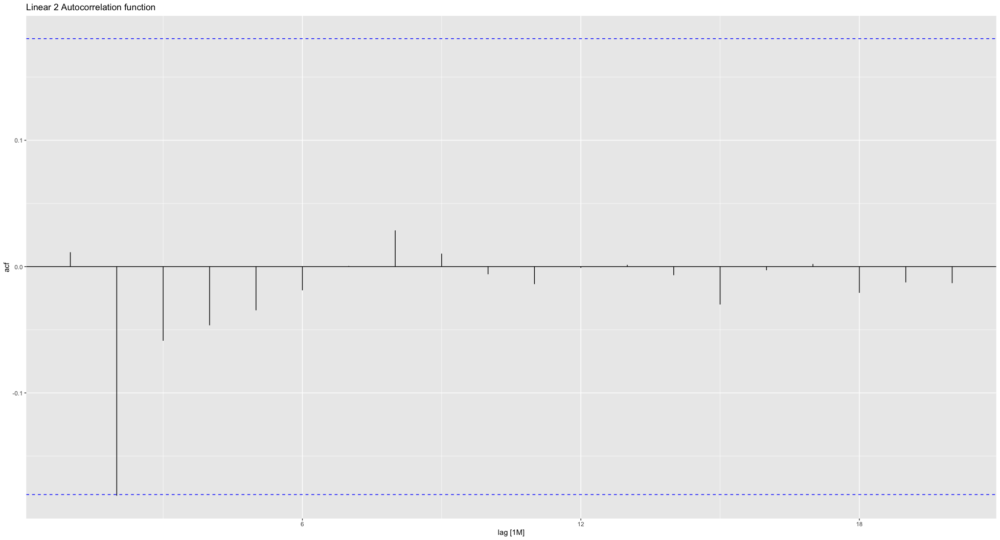

Welcome to ForecastingEnsembles! This is a package to automatically do a complete analysis of forecasting data. It works extremely well with data from the Bureau of Labor Statistics, but any similar time series data will work. It only does one thing, but it does that one thing extremely well: Automatically make forecasts from time series data.

**How does ForecastingEnsembles automatically build the most accurate models?**

The ForecastingEnsembles package automatically builds 17 models from the time series data below). The function automatically does all of the following:

• Automatically determines the features for the data set

• Automatically creates season plots

• Automatically creates lag plots

• Automatically creates baseline forecasts (which can be difficult to beat in some situations!)

• Automatically plots the value of the time series (such as the number of employees each month)

• Automatically plots individual periods

• Automatically plots subseasons

• Automatically plots multiple lags

• Automatically plots the value (such as the number of employees per month)

• Automatically creates a table of the head and tail of the time series data

• Automatically plots the value vs the seasonally adjusted value

• Automatically plots the value vs the trend

• Automatically plots the decomposition of the value

• Automatically plots the anomalies in the time series

• Splits the time series into train and test sets, using the values given by the user.

# Example: Bureau of Labor Statistics, All Nonfarm Employees from January, 2015 through October, 2024

(The original data may be downloaded as a CSV file here: <https://data.bls.gov/dataViewer/view/timeseries/CES0000000001> and then converted to a tsibble for use in a time series).

This data set in the ForecastingEnsembles package is the number of non-farm employees in the United States, by month, from January, 2015 through October, 2024.

### tl::dr How the time series data is set up (as two columns of data)

In the Forecasting function, time_series_data is a time series data set. It must be set up as can be seen in this example. The time must be labeled Period, and include a year and value. For example, 2015 Jan for monthly data, 2015 Q1 for quarterly data, or 2015 W1 for weekly data. The Value must be an integer, and Value must be a capital letter No other columns are needed.

{width="200"}

The time_interval can be W (for weekly), M (for monthly) or Q (for quarterly)

Data may be imported to use for analysis.

### The one chunk of code needed to automatically run the entire analysis

```         
library(ForecastingEnsembles)

Forecasting(time_series_data = Oct_2024_all_nonfarm, train_amount = 0.60, number_of_intervals_to_forecast = 3, train_amount = 0.60, use_parallel = "Y", time_interval = "M")
```

***When we run the function with this origianl data, the results in the Features table show the data is not stationary!*** The way this can be seen is in the Time Series Features table. It clearly shows Ndiffs = 1.0000, which means that we need to take 1 difference to make the data stationary.

{width="700"}

Note that the features are extremely important to conducting an accurate analysis. According to the book, Forecasting Principles and Practice, it is best to use stationary data. Note that "stationary data is data which does not depend on the time at which the series is observed." (<https://otexts.com/fpp3/stationarity.html#stationarity>).

The importance of starting with stationary data is described in Forecasting Principles and Practice:

> An important consideration when estimating a regression with ARMA errors is that all of the variables in the model must first be stationary. Thus, we first have to check that yt and all of the predictors (x1,t,…,xk,t) appear to be stationary. If we estimate the model when any of these are non-stationary, the estimated coefficients will not be consistent estimates (and therefore may not be meaningful).

source: <https://otexts.com/fpp3/estimation.html>

The list of features provided by the ForecastingEnsembles package can help determine if a time series is stationary, or if any steps are needed to make the series stationary. The most important feature to determine if a time series is stationary is the number of differences needed (if any) to make a time series stationary.More information on time series features may be found here:

<https://otexts.com/fpp3/stlfeatures.html>

<https://otexts.com/fpp3/other-features.html>

To make the time series stationary, we have a number of options. The easiest (and most common) is to difference the data. Here are three ways to convert time series data to be stationary:

### If you need to difference data:

```         
df <- df %>% mutate(Value = difference(Value)) %>% 
  slice(-1) # the slice(-1) removes the NA row
```

### If you need to do seasonal differencing of data (in this example monthly data):

```         
df %>% mutate(Value = difference(Value, differences = 12)) %>% 
  slice(13:nrow(df)) # the slice removes the first 12 NA rows
```

### If you need to double difference data (do the difference twice):

```         
df <- df %>% mutate(Value = difference(difference(Value)))  # Note the difference(difference(Value)) part of the equation
```

We only need to do one difference, and no seasonal differences, so this is very easy:

```         
Oct_2024_all_nonfarm <- Oct_2024_all_nonfarm %>% mutate(Value = difference(Value))
```

Now our data is stationary, and the rest of the process is extremely easy to do.

We will be using the October 2024 all employees (differenced data) data in this example. The origianl data is not stationary, as we saw, and it was indicated that one difference was needed to make the data stationary. We will use the stationary data we achieved by differencing the data in this example. ***We are looking at the one month change in the number of all employees in our analysis.***

If we use the time series for all employees, it can be seen that the number of differences is 0, which indicates the time series data is stationary. This can also be checked using the unitroot_kpss test, which also confirms the data is stationary. With the kpss test, a small p-value (less than 0.05) indicates that differencing is required. The p-value here is 0.100, which supports the decision that differencing is not required for this time series.

The list of features for the Oct_2024_all_employees data set is:

{width="700"}

**Now we can run the Forecasting function, and ForecastingEnsembles takes care of everything for us!**

```         
library(ForecastingEnsembles)

Forecasting(time_series_data = Oct_2024_all_nonfarm, train_amount = 0.60, number_of_intervals_to_forecast = 3, train_amount = 0.60, use_parallel = "Y", time_interval = "M")
```

The function automatically returns the following:

### Plots

The function returns the following plots (example used is Oct_2024_all_employees):

• Value per unit of time (the basic plot):

{width="700"}

• Individual periods (it can be seen what happens each period.

{width="700"}

• Value vs trend. This gives the actual value (in black) vs the trend (in red)

{width="700"}

• Value vs seasonally adjusted value:

{width="700"}

• Full decomposition on one plot (Value, trend, season_year, remainder)

{width="700"}

• Anomalies (the blue dotted line is ± 1 standard deviation from 0, the red dotted line is ± 2 standard deviations from 0

{width="700"}

ª Subseasons (can see each subseason independently):

{width="700"}

• Multiple lags

{width="700"}

• Innovation residuals

{width="700"}

• Autocorrelation function

{width="700"}

Histogram of residuals

{width="700"}

• Actual vs predicted

{width="700"}

{width="700"}

### Summary tables

• Head (top) of the time series

{width="300"}

• Tail of the time series data

{width="300"}

• Time series features

{width="700"}

• Quartiles

{width="700"}

• Forecast with the model with the lowest AICc score

{width="700"}

• Accuracy scores for all time series models

{width="700"}

• Min, mean, max, mean of 3 most recent

{width="700"}

### List of 23 time series models used by the package

Linear (4 models, individual, individual + season, individual + trend, individual + season + trend)

ARIMA (4 models, individual, individual + season, individual + trend, individual + season + trend)

Deterministic

Stochastic

ETS (4 models, individual, individual + season, individual + trend, individual + season + trend)

Holt-Winters (3 models, Additive, Multiplicative, Damped)

Fourier (6 models, K=1, K=2, K-3, K=4, K=5, K=6)

The 23 models are fit on the training data, and the accuracy is measured against the test data using AICc.

The excellent text Forecasting Principles and Practice cites the reason for using AICc when evaluating time series models:

> Consequently, we recommend that one of the AICc, AIC, or CV statistics be used, each of which has forecasting as their objective. If the value of T is large enough, they will all lead to the same model. In most of the examples in this book, we use the AICc value to select the forecasting model.

Source: <https://otexts.com/fpp3/selecting-predictors.html>

The ForecastingEnsembles package will also use the lowest AICc value to select the optimal forecasting model.

# Grand summary

The ForecastingEnsembles package was able use the Oct_2024_all_employees time series data, and build 23 models, 7 tables and 13 plots to help the user(s) make the best forecast from the data.
